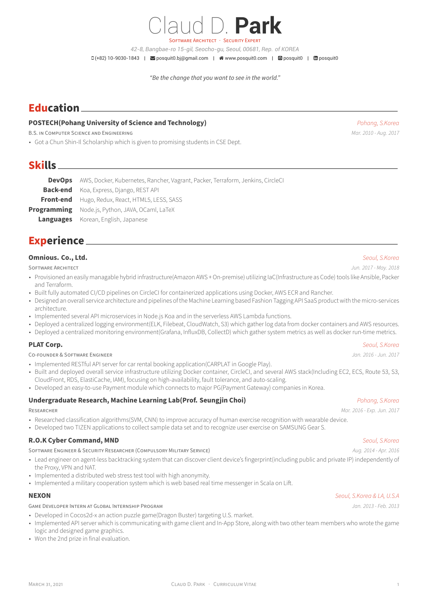
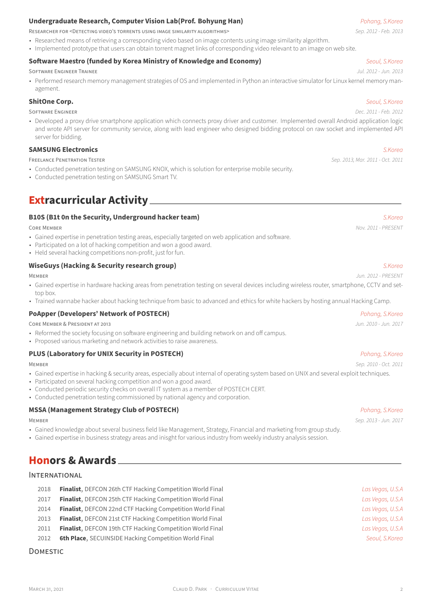

<h1 align="center">
  Awesome-CV Template
  <a href=https://img.shields.io/badge/cv-pdf-green.svg>
    
  </a>
</h1>
<p align="center">
  My own private fork of posquit0's Awesome-CV. Slimmed down the repo by removing unnecessary (for now) elements - those relating to resume and coverletter. Switched to using Rubber as compilation.
</p>
<br />

## :ghost: Preview
You can see [full PDF](example-cv.pdf).

| Page. 1 | Page. 2 |
|:---:|:---:|
| [](example-cv-1.png) | [](example-cv-2.png) |

## :exclamation: Requirements
#### For [Manjaro Linux](https://manjaro.org/) (Arch-based distro).
##### Packages:
- texlive-core
- texlive-fontsextra
- texlive-lang
- rubber
- [poppler] only if you wish to use ``$ make cv-imgs`` (uses pdftoppm to generate images from pdf (used in README))
- [code] my editor of choice here 
- [james-yu.latex-workshop] code extentension providing useful LaTeX functionality e.g. displays .pdfs inside code, syntax suggestions etc.

## :heavy_dollar_sign: Usage
#### Simplest ``$ make cv-pdf`` or modify [Makefile](Makefile) to suit your needs
Change variables set in the beginning of it if you decide to rename corresponding files/folder.
```Makefile
CV_TEX=cv               # input basename of the main .tex file (located in $(CV_DIR))
CV_DIR=cv               # input name (path) to the directory containing main .tex file
CV_PDF_NAME=example-cv  # name of the resulting .pdf file
VIEWER=code             # what program do you want to view your .pdf in after compilation (code)
```
## :mega: Credit
- [original repo on github.](https://github.com/posquit0/Awesome-CV)

## :eyes: See also
- [original README](https://github.com/posquit0/Awesome-CV/blob/4be6c213c8631a1fd68d1ad452e88b722b911f78/README.md)
